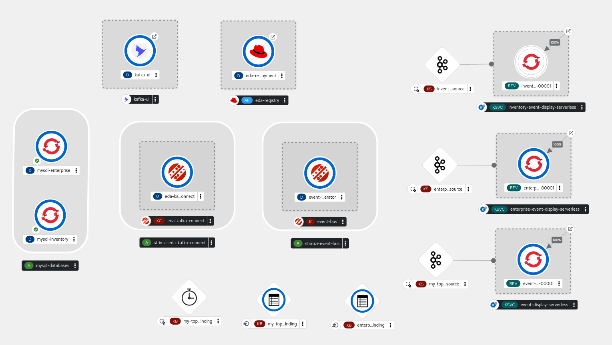
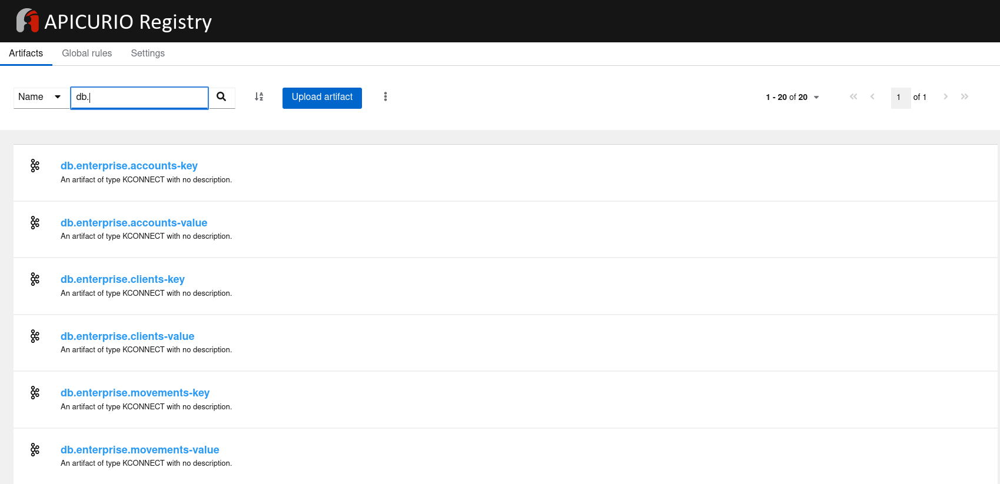

# Apache Kafka on OpenShift Demo

This is a simple demo of Apache Kafka on OpenShift using the capabilities provides
by a set of different OpenShift Operators, such as:

* Red Hat AMQ Streams
* Red Hat Integration - Service Registry
* Red Hat OpenShift Serverless
* Red Hat Integration - Camel K

The full topology of this demo on OpenShift will be similar to:



Including a full list of schemas for the Kafka management with Service Registry:



Let's play!!!

## 🌱 Set up OpenShift 🌱

This demo uses a `kafka-on-ocp-demo` namespace created with:

```shell
oc new-project kafka-on-ocp-demo
```

This demo includes the consumption of events from different MySQL databases. These databases
must be deployed before the rest of the components.

Follow the instructions of the [README](./00-databases/README.md) file.

## 🤖 OpenShift Operators 🤖

Operators are installed using Operator Lifecycle Manager (OLM), tool to help manage the
Operators running on a cluster.

**NOTE:** To deploy the different Operators we need to use an user with ```cluster-admin``` role.

```shell
oc login -u admin-user
```

```shell
oc apply -f 01-operators/
```

These operators will be installed in the `openshift-operators` namespace and will be
usable from any namespaces in the cluster.

To check the subscription statuses:

```shell
❯ oc get csv
NAME                                              DISPLAY                                           VERSION                 REPLACES                                         PHASE
amqstreams.v2.3.0-3                               AMQ Streams                                       2.3.0-3                 amqstreams.v2.3.0-2                              Succeeded
red-hat-camel-k-operator.v1.10.0-0.1682325781.p   Red Hat Integration - Camel K                     1.10.0+0.1682325781.p   red-hat-camel-k-operator.v1.8.2-0.1675913507.p   Succeeded
serverless-operator.v1.28.0                       Red Hat OpenShift Serverless                      1.28.0                  serverless-operator.v1.27.1                      Succeeded
service-registry-operator.v2.1.5                  Red Hat Integration - Service Registry Operator   2.1.5                   service-registry-operator.v2.1.4                 Succeeded
```

## 📈 Apache Kafka 📈

To deploy Apache Kafka as a broker for this demo execute:

```shell
oc apply -f 02-kafka/kafka/event-bus-kafka.yaml
```

After some minutes we should have our Apache Kafka cluster deployed. We could check as:

```shell
❯ oc get k event-bus -o yaml
apiVersion: kafka.strimzi.io/v1beta2
kind: Kafka
# ...
status:
  clusterId: kiX1LBahS6KMlTsd5WXl4A
  conditions:
  - lastTransitionTime: "2023-05-05T09:36:36.286733Z"
    status: "True"
    type: Ready
# ...
```

This Apache Kafka cluster will be available by the `event-bus-kafka-bootstrap` service:

```shell
❯ oc get svc
NAME                         TYPE        CLUSTER-IP     EXTERNAL-IP   PORT(S)                               AGE
event-bus-kafka-bootstrap    ClusterIP   10.217.5.58    <none>        9091/TCP,9092/TCP,9093/TCP            9s
event-bus-kafka-brokers      ClusterIP   None           <none>        9090/TCP,9091/TCP,9092/TCP,9093/TCP   9s
event-bus-zookeeper-client   ClusterIP   10.217.4.96    <none>        2181/TCP                              53s
event-bus-zookeeper-nodes    ClusterIP   None           <none>        2181/TCP,2888/TCP,3888/TCP            53s
```

### 📼 Deploying Kafka Topics 📼

Set of topics to store base data of our solution.

```shell
oc apply -f 02-kafka/topics
```

## 📦 Service Registry 📦

To deploy Service Registry as API Schema platform execute:

```shell
oc apply -f 03-service-registry/apicurio-registry.yaml
```

To check the current status of the Service Registry:

```shell
❯ oc get apicurioregistry eda-registry -o yaml
# ...
status:
  conditions:
  - lastTransitionTime: "2023-05-10T06:47:06Z"
    message: ""
    reason: Reconciled
    status: "True"
    type: Ready
  info:
    host: eda-registry.kafka-on-ocp-demo.router-default.apps-crc.testing
  managedResources:
  - kind: Deployment
    name: eda-registry-deployment
    namespace: kafka-on-ocp-demo
  - kind: Service
    name: eda-registry-service
    namespace: kafka-on-ocp-demo
  - kind: Ingress
    name: eda-registry-ingress
    namespace: kafka-on-ocp-demo
```

Service Registry is available outside OpenShift cluster with the next route over
the `eda-registry` application:

```shell
oc get route -l app=eda-registry -o jsonpath='{.items[0].spec.host}'
```

## ➿ Kafka Connect and Debezium Connectors ➿

Follow the instructions of the [README](./04-kafka-connect/README.md) file.

## 🫙 Serverless (Optional Extension) 🫙

Follow the instructions of the [README](./05-serverless/README.md) file.

## 🌟 Integrating with Kamelets (Optional Extension) 🌟

The Kamelets provide a good way to integrate with Apache Kafka using pre-built actions. This example
will consume the events created in the Kafka Topics and visualize as logs. However, the powerful of
the Kamelets is higher.

```shell
oc apply -f 06-kamelets
``` 

## 🏋️ Loading Data and Consuming Events 🏋️

Now, it is time to move this demo creating some data into the different databases and visualizing
how that data is stored and consumed by our Apache Kafka.

For load data into the `enterprise` MySQL Database:

```shell
./02-load-enterprise-data.sh
```

For load data into the `inventory` MySQL Database:

```shell
./03-load-inventory-data.sh
```

The Debezium Connectors will consume that data from the different databases and a set
of new Kafka Topics are created with the events associated for each data manipulated
into the database. To verify that all the KafkaTopics from each MySQL table is created:

```shell
❯ oc get kt
NAME                                                                                               CLUSTER     PARTITIONS   REPLICATION FACTOR   READY
db                                                                                                 event-bus   1            3                    True
db.enterprise.accounts                                                                             event-bus   1            3                    True
db.enterprise.clients                                                                              event-bus   1            3                    True
db.enterprise.movements                                                                            event-bus   1            3                    True
db.enterprise.regions                                                                              event-bus   1            3                    True
db.inventory.addresses                                                                             event-bus   1            3                    True
db.inventory.customers                                                                             event-bus   1            3                    True
db.inventory.geom                                                                                  event-bus   1            3                    True
db.inventory.orders                                                                                event-bus   1            3                    True
db.inventory.products                                                                              event-bus   1            3                    True
db.inventory.products-on-hand---44bc3389a59a53e02ce43a30d9e2f9d34e523a9d                           event-bus   1            3                    True
schema-changes.enterprise                                                                          event-bus   1            3                    True
schema-changes.inventory                                                                           event-bus   1            3                    True
```

Checking some of the Serverless services we can see some of the events created from the database:

```text
...
☁️ cloudevents.Event
Validation: valid
Context Attributes,
specversion: 1.0
type: dev.knative.kafka.event
source: /apis/v1/namespaces/kafka-on-ocp-demo/kafkasources/enterprise-event-display-kafka-source#db.enterprise.clients
subject: partition:0#6
id: partition:0/offset:6
time: 2023-05-10T08:24:46.663Z
Extensions,
key: {"schemaId":5,"payload":{"id":7}}
partitionkey: {"schemaId":5,"payload":{"id":7}}
Data,
{"schemaId":6,"payload":{"before":null,"after":{"id":7,"first_name":"Miguel Angel","last_name":"Dias","email":"mad@acme.com"},"source":{"version":"1.9.7.Final-redhat-00003","connector":"mysql","name":"db","ts_ms":1683707085000,"snapshot":"false","db":"enterprise","sequence":null,"table":"clients","server_id":223344,"gtid":null,"file":"mysql-bin.000003","pos":9571,"row":0,"thread":6,"query":null},"op":"c","ts_ms":1683707085661,"transaction":null}}
...
```

## Restarting a KafkaConnector

To restart a KafkaConnector:

```shell
oc annotate kafkaconnector mysql-enterprise-source-connector strimzi.io/restart=true
```

## Bonus Track - 📊 Monitoring Kafka Cluster with Kafka-UI 📊

[Kafka-UI](https://github.com/provectus/kafka-ui) is a versatile, fast and lightweight web UI for managing
Apache Kafka® clusters. It is very easy to use it and this bonus track describes how to install in our sample
and review the status of the Kafka cluster and Service Registry

This example will use the Helm Chart to deploy our local Kafka-UI instance, basically following the guidance from
the [documentation](https://docs.kafka-ui.provectus.io/configuration/helm-charts/quick-start). 

The first step is to install the Helm repo of this tool:

```shell
helm repo add kafka-ui https://provectus.github.io/kafka-ui
```

There is multiple ways to configure Kafka-UI but in our case we will use a [Helm Chart Value file](./kafka-ui/values.yaml)
for the most general properties. This file will be used with the Helm CLI.

For further details, please review the [documentation](https://docs.kafka-ui.provectus.io/configuration/configuration-file).

Finally, to deploy our instance, execute this command:

```shell
helm upgrade --install kafka-ui kafka-ui/kafka-ui -f kafka-ui/values.yaml --history-max 2
```

To access to that instance, basically check the ingress or route create for that:

```shell
oc get ingress kafka-ui
```

## Another Bonus Track - 🚀 Fast deployment 🚀

If you want move forward fast and to have this amazing things deployed in one
single step into your OpenShift cluster, there is a set of shell scripts that
help you.

* [01-deploy-infra.sh](01-deploy-infra.sh) - deploy everything in one single command

Example of usage:

```shell
./01-deploy-infra.sh
```

Load data into the `enterprise` database:

```shell
./02-load-enterprise-data.sh
./03-load-enterprise-customers-data.sh
```

Load data into the `inventory` database:

```shell
./02-load-inventory-data.sh
./03-load-inventory-customers-data.sh
```
